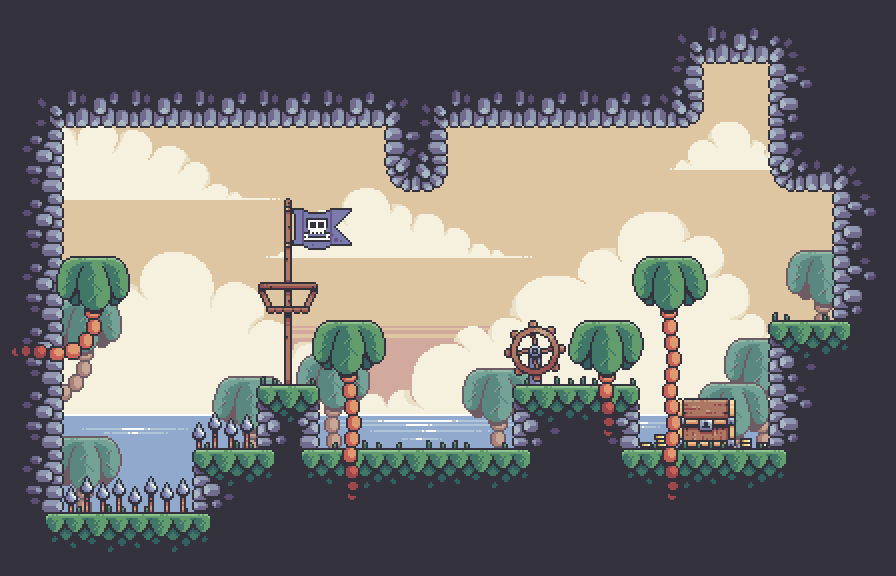

# JavaGamePlatformer

#

## Sobre o jogo
"A Caça ao Tesouro"_ é um jogo de plataforma onde os jogadores controlam um personagem pirata, _Capitão Jack_, navegando por fases repletas de desafios e inimigos. O jogo apresenta um ambiente de rolagem lateral bidimensional, onde os jogadores devem pular lacunas, desviar de perigos e derrotar inimigos agressivos com espadas. Canhões e armadilhas adicionam obstáculos adicionais ao longo do jogo. Os níveis aumentam progressivamente em dificuldade, proporcionando uma experiência envolvente e desafiadora. O tema único do pirata e a presença de caranguejos como inimigos adicionam um sabor distinto ao jogo, com o objetivo de proporcionar aos jogadores uma experiência divertida e envolvente.

## Execução  
Para fazer este projeto, precisa: 
- Language: `Java`
- Library: `Java.awt`
- IDE: `IntelliJ`, `VsCode` ou `Esclipe`.

## Metodologia

1. Pacote principal
2. Pacote de níveis
3. Pacote de Entidades
4. Pacote de objetos
5. Pacote de estados de jogo
6. Pacote de insumos
7. Pacote de IU
8. Pacote de áudio
9. Pacote de efeitos
10. Pacote Utilz

## Manual do usuário
### ✨ Navegação no menu:
- Use o clique do mouse para selecionar opções no menu do jogo.
- Pressione _`Ecs`_ para pausar o jogo.

### ✨ Sobre o personagem:
- Estatísticas do personagem: _`200HP`_ e _`200PP`_ máximo, **apenas recuperação automática de PP**.
- Movimento: _`A`_, _`D`_ e _`SPACEBAR`_ para mover _left_, _right_ e _jump_ na grade.
- Ataque: Use _`clique com o botão direito`_ para atacar, _`clique com o botão esquerdo`_ para o mais rápido.
> Nota: `ataque rápido` requer um grande consumo de energia,
 e você pode usá-lo com _`SPACEBAR`_ para surfar no ar.

### ✨ Itens:
- Poções: para recuperar stats de personagem com _`RED_POTION`_ para HP e _`BLUE_POTION`_ para PP.
- Recipiente: para conter as poções.

# Instalação
Depois que o download for concluído no github, você poderá iniciar o jogo de duas maneiras:

### ✨ Pelo Editor (VsCode, IntelliJ, Esclipe):
É só abrir esse projeto na sua IDE, depois aproveitar 

### Tutoriais e recursos
- [Treasure Hunter - Pixel Frog](https://pixelfrog-assets.itch.io/treasure-hunters): A principal fonte de conceito inspirador e animações para este projeto, incluindo personagem principal, armas, inimigos e elementos ambientais. ..
- [Tutorial de desenvolvimento de jogos Java - Kaarin Gaming](https://youtu.be/6_N8QZ47toY): uma lista de reprodução de tutoriais em vídeo que cobrem vários aspectos do projeto.
